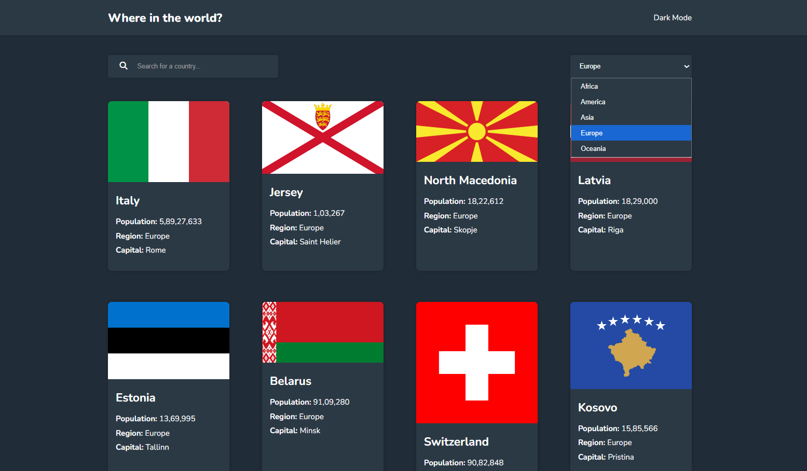

# 🌍 Country Explorer App

A simple and clean web application that displays information about all countries using the REST Countries API.  
Users can search countries, filter by region, and view details like population, capital, and flags.

---

## 🚀 Features

- Fetches real-time country data using REST Countries API  
- Search countries by name  
- Filter countries by region  
- Responsive UI  
- Shows country flag, population, capital, region, and more

---

## 🛠️ Tech Stack

- **HTML**
- **CSS**
- **JavaScript**
- **REST Countries API**
- **Fetch API**

---

## 🌐 API Used
https://restcountries.com/v3.1/all?fields=name,capital,region,population,flags,cca3

## 📸 Screenshots

### Home Page  

### Country Details  

### Dark Mode

